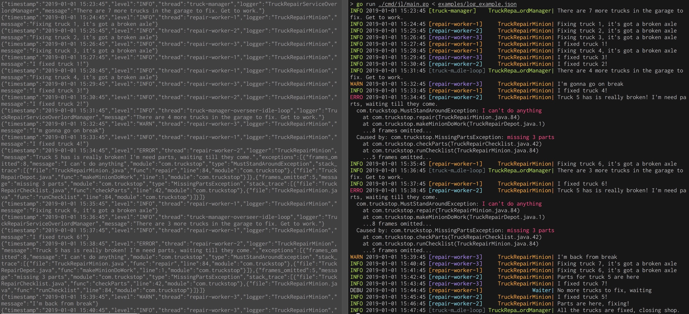

# jl - JSON Log Viewer [](https://godoc.org/github.com/mightyguava/jl) [](https://circleci.com/gh/mightyguava/jl/tree/master)

jl (JL) is a parser and formatter for JSON logs, making machine-readable JSON logs human readable again.



## Installing

```
go get -u github.com/mightyguava/jl/cmd/jl
```

## Usage

jl consumes from stdin and writes to stdout. To use jl, just pipe your JSON logs into jl. For example

```sh
./my-app-executable | jl
cat app-log.json | jl
```

jl can read from a file too

```sh
jl my-app-log.json
```

jl itself doesn't support following log files, but since it can consume from a pipe, you can just use `tail`
```sh
tail -F app-log.json | jl
```

you can page jl's colorized output using `less` with the `-R` flag

```sh
jl my-app-log.json | less -R
```

## Formatters

jl currently supports 2 formatters, with plans to make the formatters customizable.

The default is `-format compact`, which extracts only important fields from the JSON log, like `message`, `timestamp`, `level`, colorizes and presents them in a easy to skim way. It drops un-recongized fields from the logs.

The other option is `-format logfmt`, which formats the JSON logs in a way that closely resembles [logfmt](https://blog.codeship.com/logfmt-a-log-format-thats-easy-to-read-and-write/). This option will emit all fields from each log line.

Both formatters will echo non-JSON log lines as-is.

## Log formats

JSON application logs tend to have some core shared fields, like `level`, `timestamp`, and `message`
that jq tries to discover and prioritize for formatting. For now, the following formats work best
with jq. For string fields other than `level`, only the keys matter.

### Java-like
```json
{
  "level": "error",
  "timestamp": "2019-02-02 15:39:45",
  "logger": "HelloWorldService",
  "thread": "main",
  "message": "hello world",
  "exceptions": [{
    "module": "com.MyApp",
    "type": "HelloException",
    "stack_trace": [{...}]
  }]
}
```
See [log_example.json](./examples/log_example.json) for a more complete example.

### Go/Logrus-like
```json
{
  "level": "error",
  "timestamp": "2019-02-02 15:39:45",
  "msg": "hello world",
  "error": "hello error",
  "stack": "\nhello\n\thello.go\nworld\n\tworld.go"
}
```

## Roll your own format

If the format that JL provides does not suit your needs, All of jl's functionality is available as
API, and it's simple to build your own CLI client. See the [godocs](https://godoc.org/github.com/mightyguava/jl)
for the API.

To change the compact format, all you need to do is provide another
[`[]FieldFmt` specification](https://github.com/mightyguava/jl/blob/f46b94a89340cc314dcaf07622b94fe7dce8f60a/compact_printer.go#L27)

In the future, I plan to make jl configurable via either flags or config files, if there is demand
for it.
